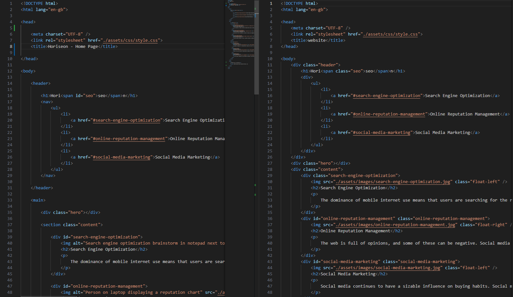
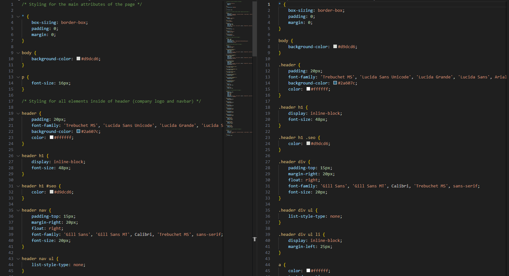

# Horeiseon Bootcamp Challenge

## Description

This is the first challenge assignment for the Frontend Bootcamp Course. In this challenge, I have been tasked with refactoring the supplied code to make it more user friendly and to follow accessability standards, allowing the site to be optimised for search engines.

In this task I learned how to use different semantic HTML elements to allow for SEO and user accessability.

Some things I have done to make the website more accessable are:

- Added Semantic HTML elements such as `header`, `section`, `aside` and `footer`.
- Added `alt` attributes to all images.
- Made links jump to relevant parts of the page when clicked.

I also optimised the code, hopefully, making it more easily readable.

Some things I have done to make the code more readable are:

- Added line spacing between parent and child elements.
- Added ids - instead of classes - to one-off elements.
- Restructured the CSS file so that it corresponds to the layout of the website's HTML.

The images below show some of the changes that I made (original on the right, my refacored code on the left):

As you can see, I have replaced some of the `div` elements on the page with more relevant semantic elements. I have also added `alt` attributes to images and deleted some classes where I thought they were irrelevant.

Here I have restructured the CSS code to better fit the layout of the pages HTML. I have also added comments to the file to help understand what each of the sections are doing.

## Installation

N/A

## Usage

The website can be accessed via this link:

## License

N/A

